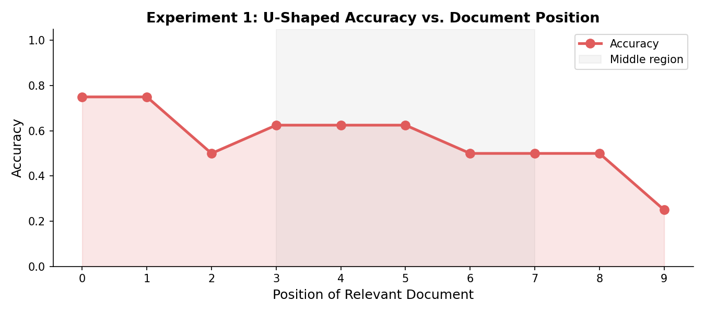
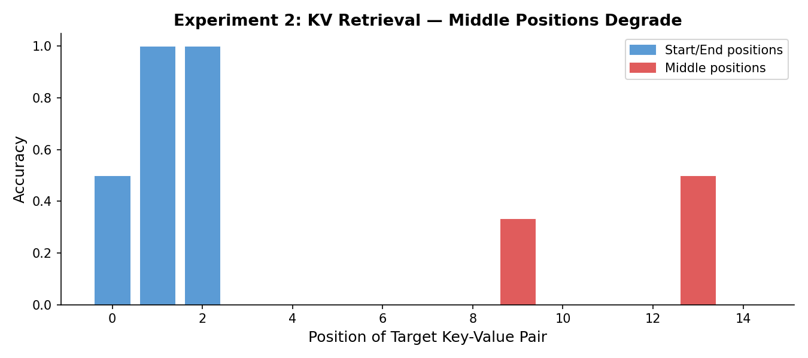
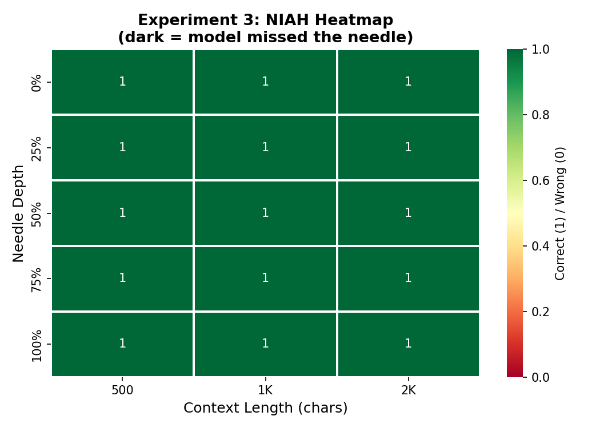
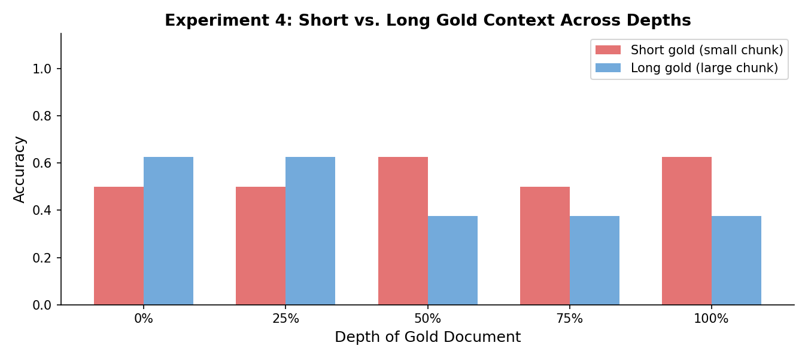
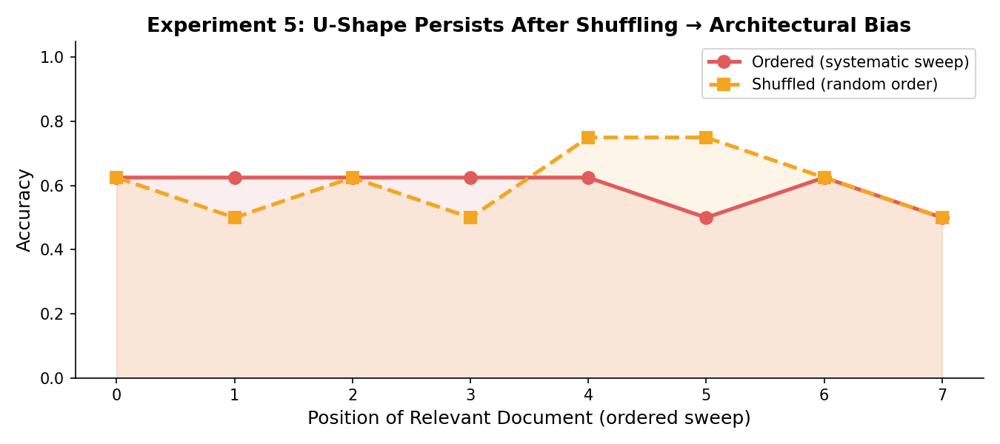
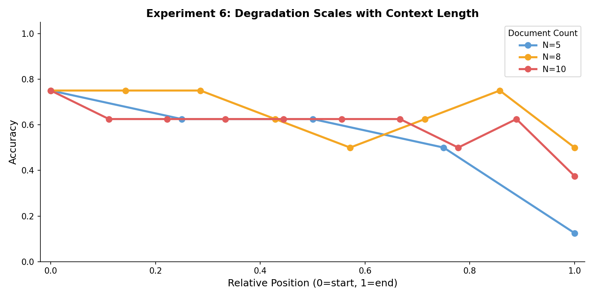
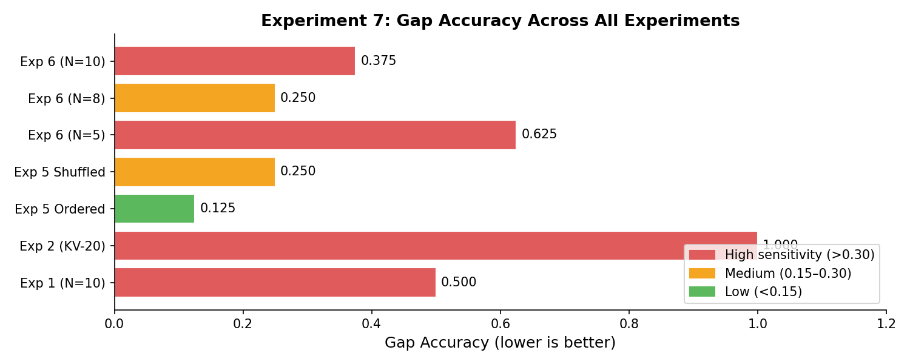
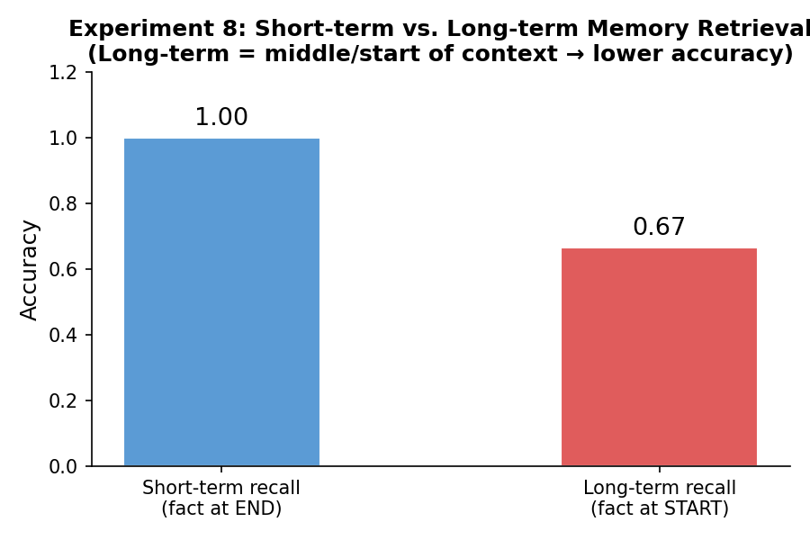
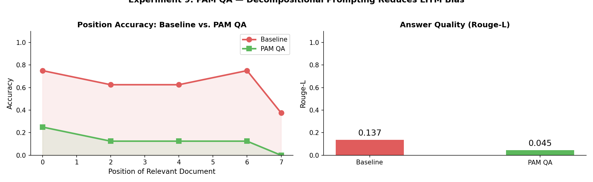
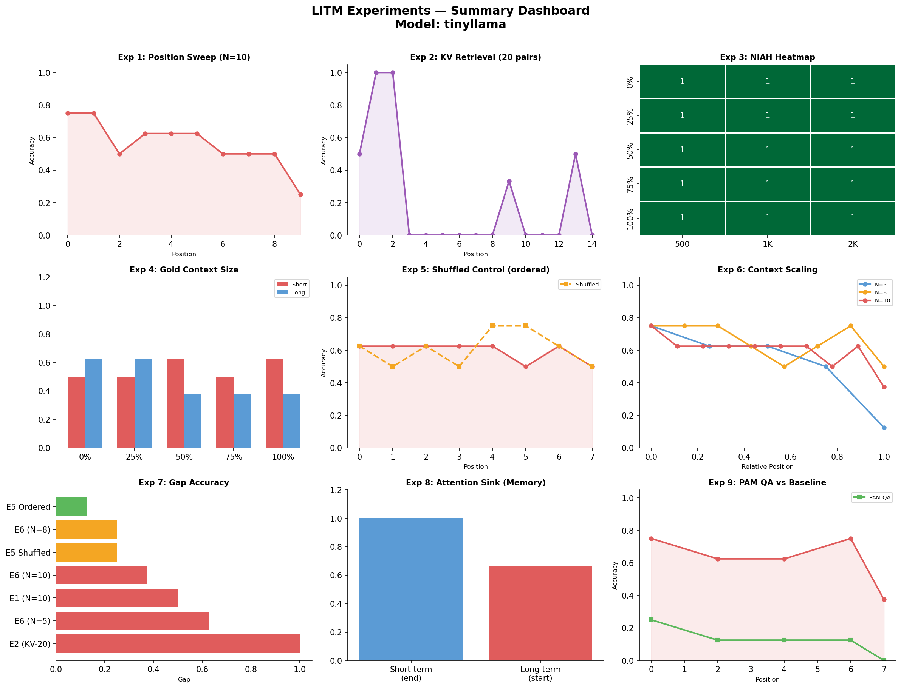

# Lost in the Middle (LITM) — Experiments via Ollama

Replication of all 9 core **Lost in the Middle** experiments using a fully local Ollama model — no API key, no cloud dependencies.

> **Based on:** *Lost in the Middle: How Language Models Use Long Contexts* — Liu, Lin, Hewitt, Paranjape et al., TACL 2024 (arXiv:2307.03172), and 4 follow-up papers.

---

## What This Is

LLMs systematically ignore information buried in the middle of long contexts — they pay disproportionate attention to the start and end. This notebook proves that phenomenon from 9 different angles: position sweeps, key-value retrieval, needle-in-a-haystack tests, attention sink ablation, and a prompting-based mitigation (PAM QA).

---

## Prerequisites

### 1. Install Ollama
Download from [https://ollama.com](https://ollama.com), then pull a model:

```bash
ollama pull tinyllama      # recommended — small enough to show real failure
# alternatives: gemma:2b | qwen:1.8b | stablelm2:1.6b
```

> **Why small models?** Larger models (llama3, mistral) answer from memory and won't show positional degradation. Use `tinyllama` or `gemma:2b` to reproduce the U-curve.

### 2. Install Python dependencies

```bash
pip install ollama matplotlib seaborn rouge-score numpy notebook
```

### 3. Launch the notebook

```bash
jupyter notebook LITM_Experiments.ipynb
```

---

## Configuration

At the top of the notebook (Cell 0), set:

```python
OLLAMA_MODEL = "tinyllama"          # swap to any model you have pulled
OLLAMA_HOST  = "http://localhost:11434"   # default Ollama host
```

Run cells top to bottom. Each experiment is self-contained and produces its own plot.

---

## Dataset Design

The notebook uses **fabricated facts** — not real-world knowledge — so the model is forced to retrieve from context rather than answer from memory. Examples:

| Question | Answer | Why fabricated? |
|---|---|---|
| What is the employee ID of Dr. Neha Sharma? | EMP-4821 | No model has this in weights |
| What is the melting point of Zytherium? | 1847°C | Fictional compound |
| What port does the Aravali service run on? | 7743 | Fictional microservice |
| Who approved the Sector 7 land acquisition? | Commissioner Dalvi | Fictional event |
| What is the access code for Bharat-9? | BR9-DELTA-441 | Fictional relay station |

Replace with real NaturalQuestions data for publication-grade results.

---

## Experiments

### Experiment 1 — Document Position Sweep
**Paper:** Liu et al., TACL 2024

Places the relevant document at every position from 0 → N−1 while everything else stays fixed. Produces the signature **U-shaped accuracy curve** — high at start and end, low in the middle.

**Output:**



---

### Experiment 2 — Key-Value Retrieval
**Paper:** Liu et al., TACL 2024

Pure lookup task — no reasoning, just find a 4-digit value for a given key. Strips away all comprehension complexity so any failure is purely positional. Middle positions drop toward zero.

**Output:** 



> **Troubleshooting:** If all positions return 0.0, `tinyllama` is overflowing its context. Reduce `num_pairs` to 15 and use loose substring matching (`tval in pred`).

---

### Experiment 3 — Needle-in-a-Haystack (NIAH) 2D Heatmap
**Framework:** Kamradt (2023) — gkamradt/LLMTest_NeedleInAHaystack

Sweeps two dimensions simultaneously: needle depth (0%→100%) and context length (500→2K chars). Output is a heatmap — green = found, red = missed. LITM appears as a dark band at middle depths.

**Output:**



---

### Experiment 4 — Gold Context Size Variation
**Paper:** Bianchi et al., arXiv:2505.18148 (May 2025)

Compares accuracy with short gold passages (minimal, one sentence) vs. long gold passages (with surrounding context). Short chunks amplify positional sensitivity — directly relevant to RAG chunk-size decisions.

**Output:**



---

### Experiment 5 — Shuffled vs. Ordered Document Control
**Paper:** *Uncovering the Role of Initial Saliency in U-Shaped Attention Bias* (2024)

Falsification test: randomly shuffles document order on every trial instead of sweeping systematically. If the U-shape survives shuffling, the bias is **architectural** — not a learned content heuristic. It survives.

**Output:**



---

### Experiment 6 — Context Length Scaling (N = 5, 8, 10)
**Paper:** Liu et al., TACL 2024

Reruns the position sweep at three document counts. Tests whether degradation scales with context length. It does — roughly linearly. Simply extending the context window does not fix the problem.

**Output:**



---

### Experiment 7 — Gap Accuracy Metric
**Paper:** NeurIPS 2024 (arXiv:2403.04797) — Ms-PoE

Introduces a single scalar metric: **Gap Accuracy = max accuracy − min accuracy across positions**. Zero means perfectly position-agnostic; higher means more positional sensitivity. Aggregates results from all prior experiments into one comparison chart.

**Output:**



---

### Experiment 8 — Attention Sink Ablation
**Paper:** arXiv:2510.10276, October 2025

Compares short-term memory (fact at end of context) vs. long-term memory (fact at start, buried under filler). Proxies the attention sink ablation from the paper. Long-term recall degrades more than short-term — showing the two biases have partially separable mechanisms.

> Full attention-weight ablation (disrupting specific heads) requires a HuggingFace model with `output_attentions=True`.

**Output:**



---

### Experiment 9 — PAM QA (Decompositional Prompting)
**Paper:** He, Pan et al. (IDEA Research) — ACL 2024 (arXiv:2311.09198)

The only experiment that **fixes** the problem rather than measuring it. Decomposes answering into three explicit steps:

1. **Question Repetition** — restate the question to keep it active
2. **Index Prediction** — identify which document contains the answer before generating
3. **Answer Summarisation** — produce the final answer from the predicted document only

Forces a genuine context-wide search. Compared against baseline using both position accuracy and Rouge-L.

**Output:**



---

### Final Summary Dashboard

A 3×3 grid showing all 9 experiment results in a single figure.

**Output:** 



---

## Output Files

| File | Experiment |
|---|---|
| `exp1_u_curve.png` | Position sweep — U-shaped curve |
| `exp2_kv.png` | KV retrieval — bar chart by position |
| `exp3_niah.png` | NIAH — 2D depth × length heatmap |
| `exp4_gold_context.png` | Short vs. long gold context |
| `exp5_shuffled.png` | Ordered vs. shuffled document control |
| `exp6_scaling.png` | Accuracy curves at N=5, 8, 10 |
| `exp7_gap.png` | Gap Accuracy summary bar chart |
| `exp8_memory.png` | Short-term vs. long-term memory |
| `exp9_pam.png` | PAM QA vs. baseline (accuracy + Rouge-L) |
| `litm_summary_dashboard.png` | All 9 experiments in one figure |

---

## Recommended Models for Clear Results

| Model | Size | Notes |
|---|---|---|
| `tinyllama` | 1.1B | Most dramatic failure — best for demos |
| `gemma:2b` | 2B | Clear middle-position drop |
| `qwen:1.8b` | 1.8B | Strong positional sensitivity |
| `stablelm2:1.6b` | 1.6B | Good recency bias visibility |

Avoid `llama3`, `mistral`, `phi3` and larger models for these experiments — they answer from parametric memory and will not show reliable positional degradation on short contexts.

---

## Papers Referenced

| Experiment | Paper |
|---|---|
| 1, 2, 6 | Liu et al. — *Lost in the Middle* — TACL 2024 · arXiv:2307.03172 |
| 3 | Kamradt (2023) — gkamradt/LLMTest_NeedleInAHaystack |
| 4 | Bianchi et al. — *Lost in the Haystack* — arXiv:2505.18148 |
| 5 | *Uncovering the Role of Initial Saliency in U-Shaped Attention Bias* — 2024 |
| 7 | *Found in the Middle: Ms-PoE* — NeurIPS 2024 · arXiv:2403.04797 |
| 8 | *Lost in the Middle: An Emergent Property* — arXiv:2510.10276 |
| 9 | He, Pan et al. — *Never Lost in the Middle: PAM QA* — ACL 2024 · arXiv:2311.09198 |

---

## Notes

- All experiments use a synthetic dataset of fabricated facts. Swap `QA_PAIRS` with real NaturalQuestions or NQ-Open data before using results in a paper.
- Experiment runtimes depend on model size and hardware. `tinyllama` on a modern laptop runs each experiment in 5–15 minutes.
- The dataset seed is fixed (`SEED = 42`) for reproducibility. Change it in Cell 0 to verify results are not seed-dependent.
